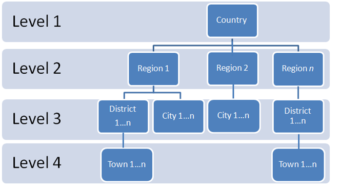
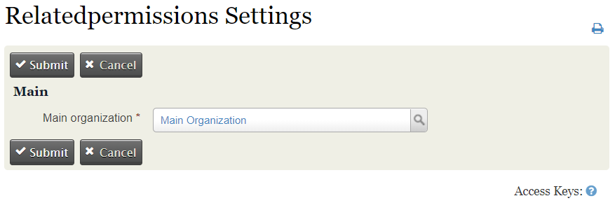
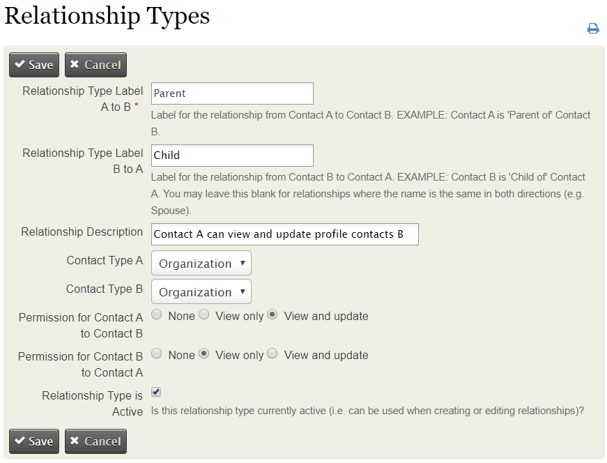
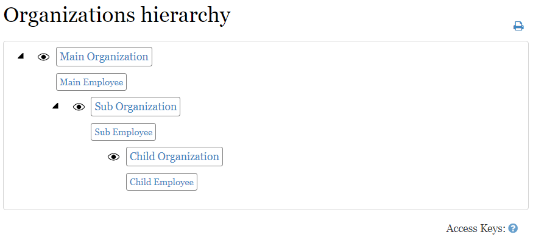

# com.agiliway.custompermission

The Custom Permission extension (com.agiliway.custompermission) is a CiviCRM component which implements CiviCRM orgstructure-based access control functionality for multi-unit hierarchically structured organizations. The extension supports permission allocation by roles and units.   

####Custom Permission Extension allows:
* building a hierarchical organization structure through CiviRelationship  
* setting up relationships between organization units and assigning permissions accordingly 
* setting up user/organization relationship and assigning permissions accordingly 
* allowing access only to a specified organization unit the user belongs to 
* creating roles that regulate access to different areas of information for each user 
* extending access for selected roles to employees and other organization constituents 
* applying access rules to all components (contacts, cases, activities, events) 
## 
####Follow these steps to assign permissions: 
* Go to CiviCRM admin panel 
* Install Custom Permission Extension: Administer => System Settings => Extensions  
* Input the main organization name: Administer => Сustom Permissions settings 
## 
* Define constituents of the organization hierarchy: Administer => Customize Data and Screens => Relationship Types 
## 
* Set up relationship between the organization and its employees: Administer => Customize Data and Screens => Relationship Types
## 
* In view of such settings the contacts are granted the following access permissions:  
## 

###In view of such settings the contacts are granted the following access permissions:  
#####Main Employee:
* View and Edit the Main Organization profile; 
* View and Edit the Sub Organization and Sub Employee profiles; 
* View and Edit the Child Organization and Child Employee profiles. 

#####Sub Employee:
* View the Main Organization and Main Employee profiles; 
* View and Edit the Sub Organization profile; 
* View and Edit the Child Organization and Child Employee profiles. 

#####Child Employee: 
* View the Main Organization and Main Employee profiles; 
* View the Sub Organization and Sub Employee profiles; 
* View and Edit the Child Organization profile 

#####Required CMS permissions: 
* CiviCRM: view my contact 
* CiviCRM: edit my contact 
* CiviCRM: access CiviCRM backend and API 

### Requirements:
CiviCRM v4.6.x, v4.7.x, v5.x 
